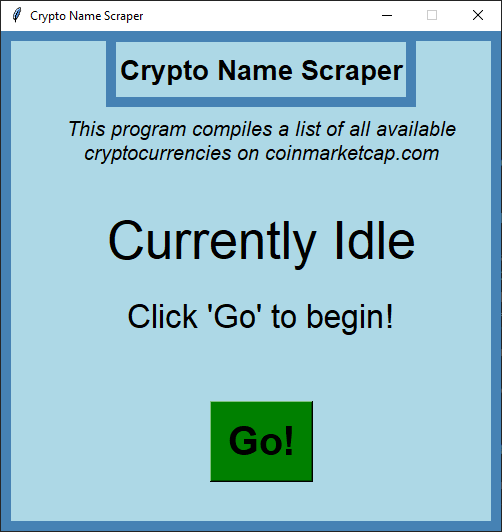
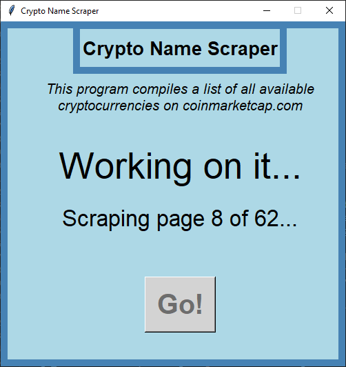

# Crypto-Names-Scraper-OLD
**Old project, functionality has been rolled into CrypoAlert**

Scrapes all available crypto names and symbols from coinmarketcap.com, constructs their corresponding urls, and then outputs the data into a csv file named "cryptos.csv". Includes a GUI. Written specifically to generate data for use with hgembinski/CryptoAlert.

Utilizes BeautifulSoup, Pandas, and Tkinter.

## Screenshots ##
<table>
  <tr>
    <td align="center"><b>Idle Screen</b></td>
     <td align="center"><b>Working Screen</b></td>
     <td align="center"><b>Done Screen</b></td>
  </tr>
  <tr>
    <td></td>
    <td></td>
    <td></td>
  </tr>
 </table>
